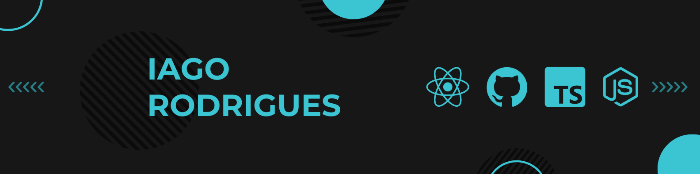

# 📝About Me

I have studied programming for 3 years. I've been trying to delve deeper into react, and here I post projects that I'm developing

  

#  Technologies That I Know

<table align="center"><tr><td valign="top" width="30%">

### 
 Frontend 

</td><td valign="top" width="30%">

### 
 Back / Databases

</td><td valign="top" width="30%">

### 
 Back / Databases

</td></tr></table>
  

# 📊 GitHub Stats

  
  

  
  

 
 

 
  
  
  
  <!--  	 -->
<!--    -->
  <!--    -->
  

 

  
  

